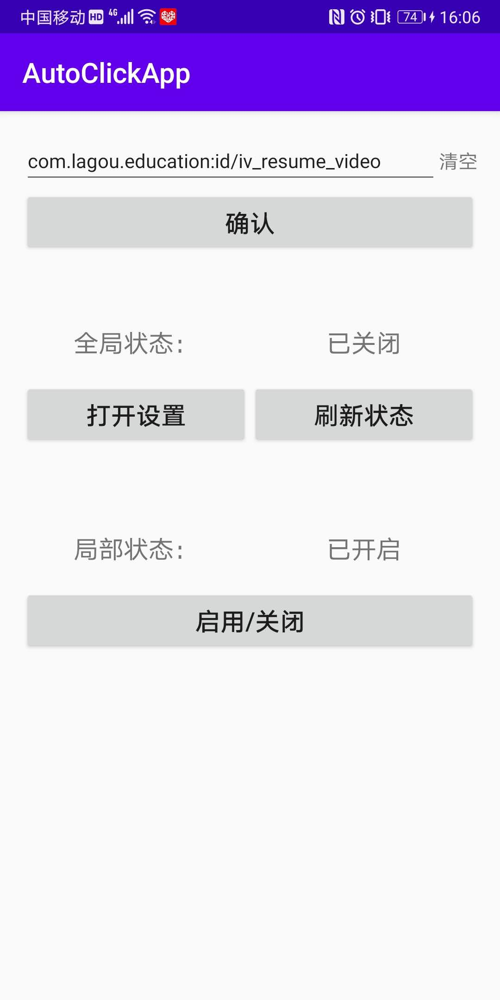

## 模拟自动点击APP

思路是：
通过无障碍模式（AccessibilityService），来完成控件的查找和点击；

1. 找到要点击的目标控件；
2. 执行点击；

效果图：

参考资料： [Android后台模拟点击探索（附源码）_披萨大叔的博客-CSDN博客_安卓 后台点击 屏幕](https://blog.csdn.net/qq_27258799/article/details/79144764)

